<a href="https://www.secureops.it">
  <picture>
    <source media="(prefers-color-scheme: dark)" srcset="assets/banner-dark.svg">
    
  </picture>
</a>

### Hi, I’m Hamidreza 👋

I help companies design, secure and change their networks and cloud with confidence. For 12+ years I’ve worked on firewalls, AWS, VPNs and segmentation for banks, ports, airlines and SaaS platforms. I care as much about the plan and the handover as about the configuration.

Based in **Rome**, working with teams across Europe. Currently **available for new projects**.

### How I can help

| | |
|---|---|
| **Zero Trust access** | Remote and admin access that checks who and what device, with nothing exposed to the internet. |
| **Segmentation** | Critical systems split into zones, so one compromised server can’t reach your data. |
| **Firewall migration** | New firewalls or vendors with a reviewed rule base, a tested cutover and a way back. |
| **Hybrid cloud** | Offices, data centre and AWS connected over encrypted tunnels with one place to control access. |
| **Audit readiness** | Monitoring, controls and evidence in place before the SOC 2 auditor arrives. |

### How I work

`01 Look` → `02 Draw` → `03 Change` → `04 Hand over`

> I’d rather spend an extra day planning than an extra night rolling back.

### Platforms I work with

`Cisco Firepower / ASA` `FortiGate` `Juniper SRX` `Palo Alto` `AWS` `Cloudflare ZTNA` `Wazuh` `SD-WAN`

**Certified:** AWS Solutions Architect – Associate · Fortinet FortiOS 7.6 Administrator

### Get in touch

[**secureops.it**](https://www.secureops.it) · [LinkedIn](https://www.linkedin.com/in/hamidrezakhazaie/) · [Malt](https://www.malt.com/profile/hamidrezakhazaie) · [info@secureops.it](mailto:info@secureops.it)
